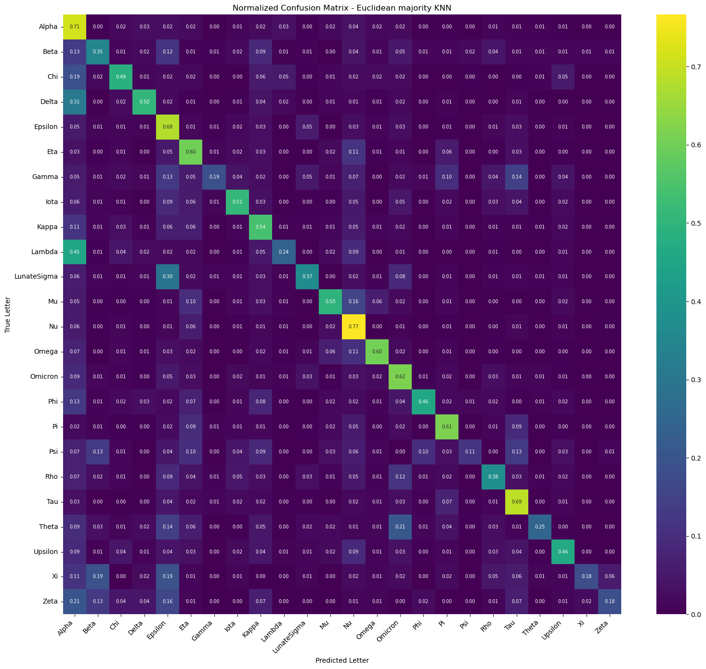
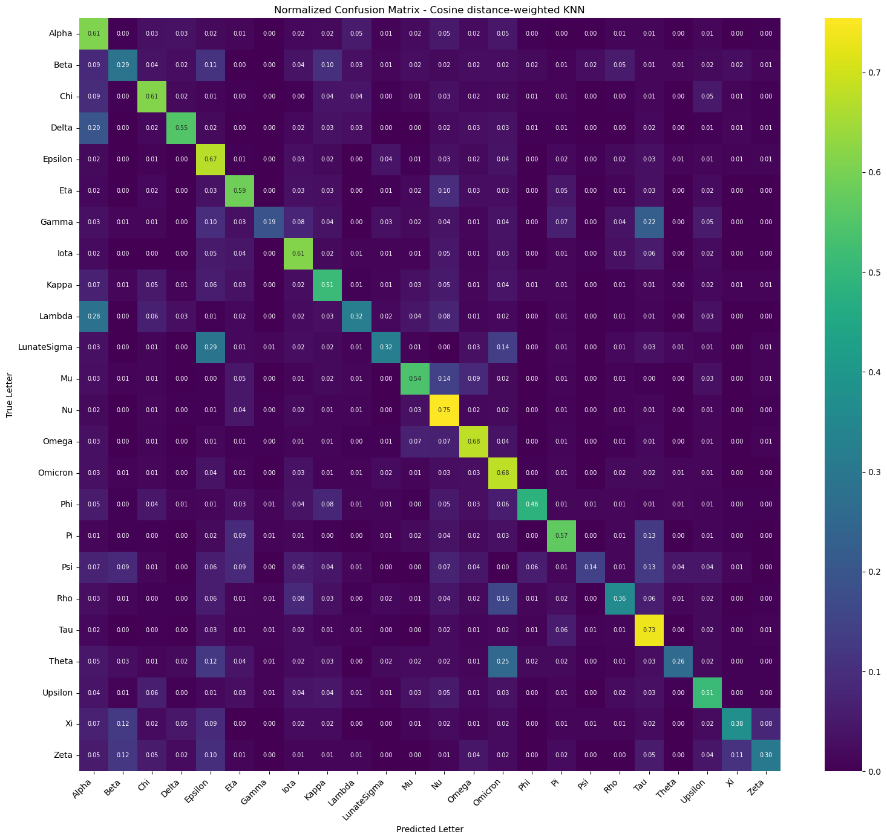
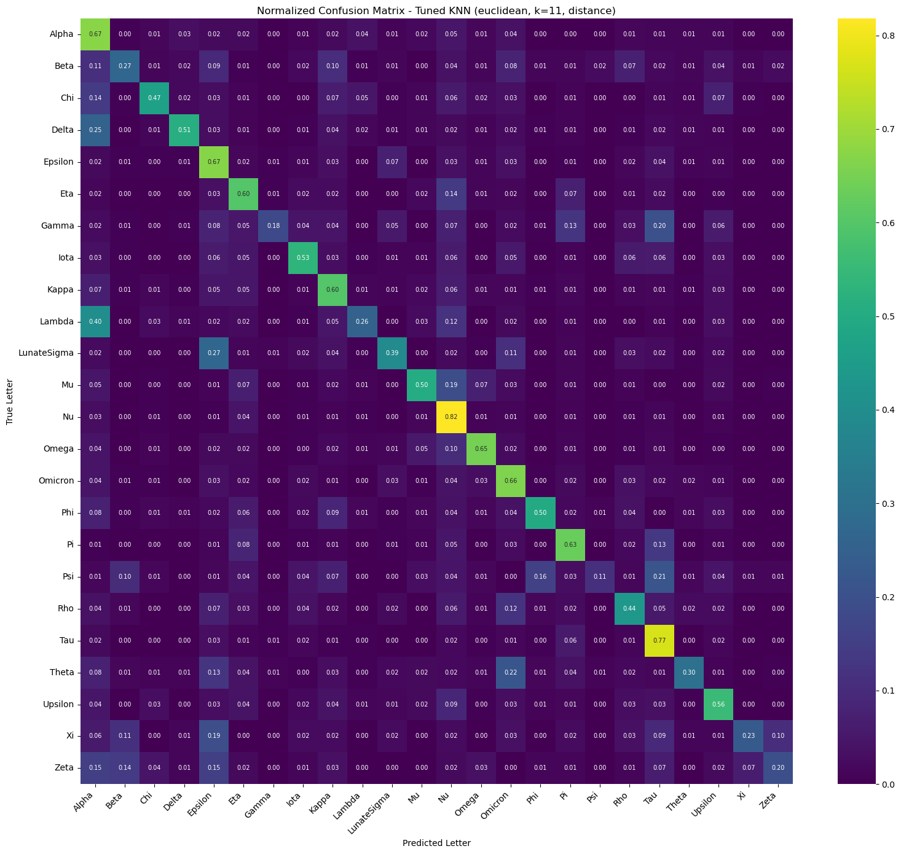

# Report: `05_final_knn_7`

## Objective

This study evaluates several k-nearest neighbors (k-NN) configurations for a 24-class Greek letter classification task based on precomputed VGG-16 `block4pool` feature vectors. The central aim is to assess how the choice of distance metric, voting scheme, and limited hyperparameter optimization affects classification performance.

## Data Basis and Experimental Setup

The classification task is based on:

- `55,329` feature vectors
- `512` features per sample
- `24` target classes

The class labels were loaded together with the class-index mapping. To ensure a balanced evaluation, the dataset was partitioned using a stratified train-test split:

- training set: `44,263` samples
- test set: `11,066` samples

All feature vectors were standardized using `StandardScaler`. This transformation places all dimensions on a comparable scale and is particularly relevant for distance-based classifiers such as k-NN.

The baseline comparison used `k = 7` nearest neighbors and a batch-wise brute-force prediction procedure. Performance was assessed using:

- accuracy
- macro-F1 score
- weighted-F1 score

In addition, normalized confusion matrices were generated for each approach in order to analyze class-wise behavior.

## Methodological Variants

### 1. Euclidean Majority k-NN

The first configuration uses Euclidean distance to identify the seven nearest neighbors. Each neighbor contributes one unweighted vote, and the predicted class is determined by simple majority.

This variant serves as the baseline because it represents the conventional form of k-NN classification without distance-dependent weighting.

**Results**

- Accuracy: `0.5548`
- Macro-F1: `0.4813`
- Weighted-F1: `0.5462`

### 2. Euclidean Distance-Weighted k-NN

The second configuration retains Euclidean distance but replaces majority voting with distance-weighted voting. The influence of each neighbor is scaled according to:

`weight = 1 / (distance + 1e-12)`

This formulation gives more importance to nearby training instances and reduces the influence of more distant neighbors within the local neighborhood.

**Results**

- Accuracy: `0.5667`
- Macro-F1: `0.4956`
- Weighted-F1: `0.5581`

### 3. Cosine Distance-Weighted k-NN

The third configuration applies L2 normalization to the feature vectors and uses cosine similarity for neighbor retrieval. Similarity values are converted into cosine distances, which are then used in a distance-weighted voting scheme.

This approach emphasizes angular similarity between feature vectors rather than absolute spatial distance. Such a formulation can be advantageous when the direction of the embedding contains more discriminative information than its magnitude.

**Results**

- Accuracy: `0.5662`
- Macro-F1: `0.4960`
- Weighted-F1: `0.5570`

### 4. Hyperparameter-Tuned k-NN

The final configuration extends the comparison by conducting a limited hyperparameter search with `GridSearchCV`. A pipeline-based design was used to combine optional normalization with the classifier. The search space comprised:

- number of neighbors: `3, 5, 7, 9, 11`
- voting rule: `uniform` or `distance`
- Euclidean and Manhattan distance without additional normalization
- cosine distance with `Normalizer()`

The search was optimized for **macro-F1** using **3-fold stratified cross-validation**. In total, `30` parameter combinations were evaluated, resulting in `90` model fits.

The best cross-validation result was:

- Best CV macro-F1: `0.4915`
- Best parameters:
  - metric: `euclidean`
  - neighbors: `11`
  - weights: `distance`
  - normalizer: `passthrough`

Evaluation on the held-out test set yielded:

- Accuracy: `0.5795`
- Macro-F1: `0.5019`
- Weighted-F1: `0.5688`

## Comparative Analysis

The comparison reveals three main effects.

### Effect of the voting strategy

The transition from majority voting to distance-weighted voting produced a clear improvement under Euclidean distance:

- Accuracy increased from `0.5548` to `0.5667`
- Macro-F1 increased from `0.4813` to `0.4956`
- Weighted-F1 increased from `0.5462` to `0.5581`

This indicates that local proximity carries relevant information beyond neighbor membership alone. Closer samples appear to be more representative of the correct class than more distant samples within the same neighborhood.

### Effect of the distance metric

The comparison between Euclidean distance-weighted and cosine distance-weighted classification shows only a small difference:

- Euclidean weighted achieves slightly higher accuracy and weighted-F1
- Cosine weighted achieves a marginally higher macro-F1

This suggests that both distance formulations are viable for the feature representation, but neither produces a decisive advantage at `k = 7`.

### Effect of hyperparameter tuning

The strongest improvement was achieved through targeted hyperparameter optimization. The tuned model outperformed all manually specified configurations:

- Accuracy increased to `0.5795`
- Macro-F1 increased to `0.5019`
- Weighted-F1 increased to `0.5688`

The selected configuration indicates that a somewhat larger neighborhood (`k = 11`) combined with distance weighting provides a more favorable bias-variance tradeoff than the smaller fixed neighborhood used in the initial comparison.

## Performance Summary

| Approach | Accuracy | Macro-F1 | Weighted-F1 |
| --- | ---: | ---: | ---: |
| Tuned KNN (euclidean, k=11, distance) | 0.5795 | 0.5019 | 0.5688 |
| Cosine distance-weighted KNN | 0.5662 | 0.4960 | 0.5570 |
| Euclidean distance-weighted KNN | 0.5667 | 0.4956 | 0.5581 |
| Euclidean majority KNN | 0.5548 | 0.4813 | 0.5462 |

## Interpretation of the Confusion Matrices

The normalized confusion matrices support the quantitative findings. The baseline approach exhibits broader off-diagonal structure, indicating more frequent class confusions. Introducing distance weighting reduces several of these confusions, especially for classes that are locally similar but separable through fine-grained neighborhood structure.

The tuned model shows the most concentrated diagonal overall, which is consistent with its superior global metrics. Nevertheless, persistent confusion remains among visually related classes, which suggests that part of the remaining error is attributable to feature-level overlap rather than purely classifier choice.

## Final Summary

The experimental comparison demonstrates that performance depends primarily on two factors: the use of distance-weighted voting and the selection of an appropriate neighborhood size. Simple majority voting yields the weakest results, whereas distance weighting consistently improves the classifier across all aggregate metrics.

The comparison between Euclidean and cosine distance shows only a minor performance gap, indicating that the extracted feature space supports both similarity notions reasonably well. The most effective configuration is obtained through small-scale hyperparameter optimization, which selects Euclidean distance, distance-weighted voting, and `k = 11`.

From a project perspective, the final model can therefore be characterized as a tuned distance-weighted k-NN classifier with Euclidean metric, offering the strongest balance between overall accuracy and class-balanced performance.
