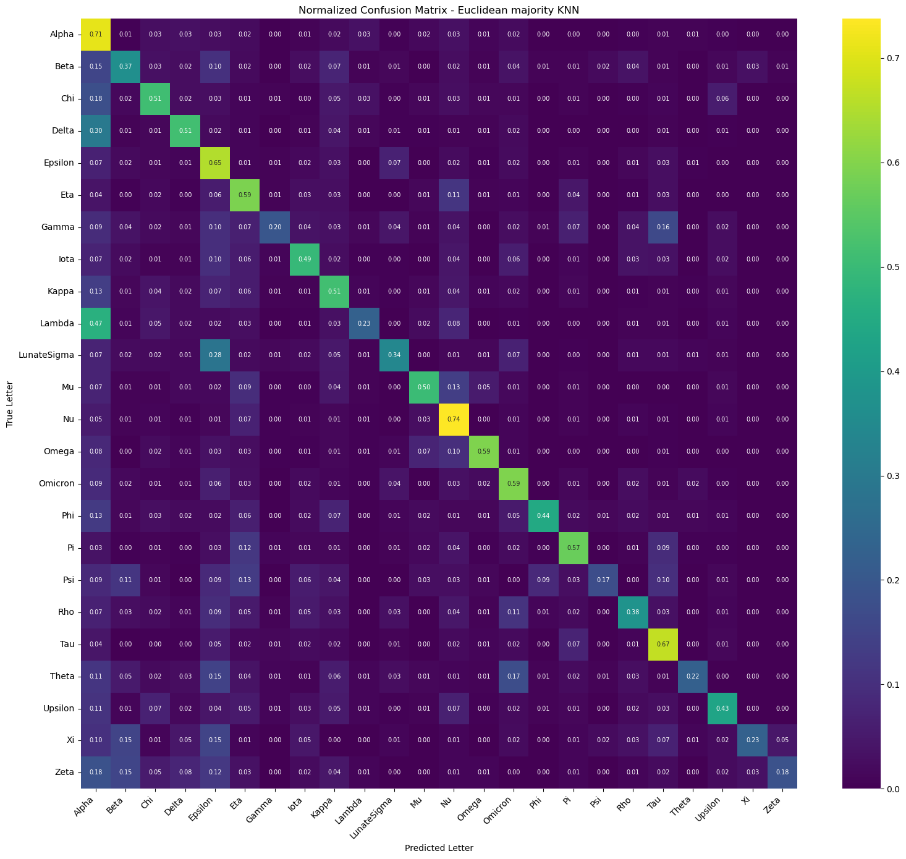
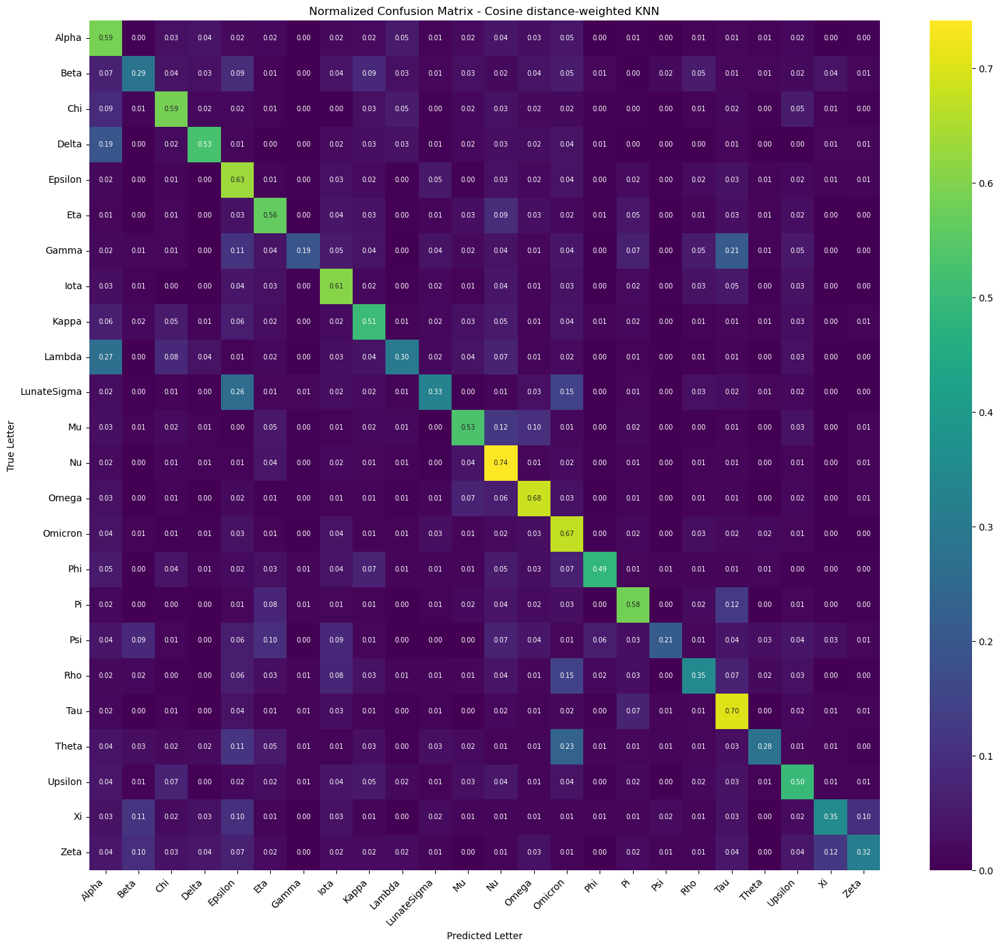

# Report: `05_final_knn.ipynb`

## Overview

This notebook compares three k-nearest neighbors (k-NN) classifiers on VGG-16 `block4pool` features. The goal is to determine which distance and voting strategy performs best on the 24-class Greek letter classification task.

The evaluation is based on:

- `features_block4pool.npy` with shape `(55329, 512)`
- `labels_block4pool.npy` with shape `(55329,)`
- `24` target classes
- a stratified `80/20` train-test split
- `k = 5` neighbors
- feature standardization with `StandardScaler`

After splitting, the notebook uses:

- training set: `(44263, 512)`
- test set: `(11066, 512)`

## What Was Done

The notebook follows this sequence:

1. Load the precomputed VGG-16 feature vectors and labels from `data/extracted_features_alena`.
2. Load the class index mapping from `class_indices.json`.
3. Split the dataset into train and test sets with stratification, so class proportions stay consistent.
4. Standardize the features using `StandardScaler`.
5. Define helper functions for:
   - tensor conversion
   - majority voting
   - distance-weighted voting
   - Euclidean k-NN prediction
   - cosine-based k-NN prediction
   - metric evaluation
   - normalized confusion matrix plotting
6. Run and evaluate three final k-NN approaches.
7. Compare the approaches using accuracy, macro-F1, and weighted-F1.

## Approaches Compared

### 1. Euclidean Majority KNN

This version uses Euclidean distance to find the `5` nearest neighbors. Each neighbor contributes one equal vote, and the class with the highest count is predicted.

This is the most standard k-NN baseline in the notebook.

**Results**

- Accuracy: `0.5405`
- Macro-F1: `0.4748`
- Weighted-F1: `0.5349`

### 2. Euclidean Distance-Weighted KNN

This version still uses Euclidean distance, but it does not treat all neighbors equally. Closer neighbors receive larger weights using:

`weight = 1 / (distance + 1e-12)`

That makes nearby samples more influential than farther ones, which is often useful when the nearest neighbors are mixed across classes.

**Results**

- Accuracy: `0.5517`
- Macro-F1: `0.4885`
- Weighted-F1: `0.5452`

### 3. Cosine Distance-Weighted KNN

This version first L2-normalizes the train and test features, then uses cosine similarity to retrieve the `5` most similar neighbors. The similarity values are converted into cosine distances, and the final vote is again distance-weighted.

This changes the geometry of the comparison:

- Euclidean distance compares absolute position in feature space.
- Cosine distance compares orientation or direction of the feature vectors.

**Results**

- Accuracy: `0.5557`
- Macro-F1: `0.4881`
- Weighted-F1: `0.5480`

## Differences Between the Approaches

### Distance function

- **Approach 1 and 2** use **Euclidean distance**.
- **Approach 3** uses **cosine similarity/distance** after normalization.

This is the main geometric difference. Euclidean distance depends on both magnitude and direction, while cosine focuses on directional similarity.

### Voting rule

- **Approach 1** uses **majority voting**.
- **Approach 2 and 3** use **distance-weighted voting**.

This is the main decision-rule difference. Majority voting gives each of the `5` neighbors the same influence, while weighted voting prioritizes the closest ones.

### Practical effect on performance

- Moving from **Euclidean majority** to **Euclidean weighted** improved all three overall metrics.
- Moving from **Euclidean weighted** to **Cosine weighted** slightly improved **accuracy** and **weighted-F1**, but produced a slightly lower **macro-F1**.

That means:

- **Euclidean weighted** is the best method if macro-level class balance is the priority.
- **Cosine weighted** is the best method if overall accuracy is the priority.

## Comparison Table

| Approach | Accuracy | Macro-F1 | Weighted-F1 |
| --- | ---: | ---: | ---: |
| Euclidean distance-weighted KNN | 0.5517 | 0.4885 | 0.5452 |
| Cosine distance-weighted KNN | 0.5557 | 0.4881 | 0.5480 |
| Euclidean majority KNN | 0.5405 | 0.4748 | 0.5349 |

## Interpretation

The notebook’s comparison shows two clear patterns:

1. **Distance-weighted voting is better than plain majority voting** for this task.
   The improvement from Approach 1 to Approach 2 suggests that the nearest samples carry more reliable class information than the slightly farther neighbors within the top-5 set.

2. **Changing the metric from Euclidean to cosine does not radically change the result**, but it shifts the tradeoff slightly.
   Cosine-weighted k-NN gives the highest accuracy, while Euclidean-weighted k-NN gives the highest macro-F1.

The near tie between the two weighted approaches suggests that the strongest gain came from the voting strategy, not from the distance metric alone.

## Final Summary

`05_final_knn.ipynb` builds a controlled comparison of three final k-NN variants on standardized VGG-16 features. All methods use the same train-test split, the same feature representation, and the same number of neighbors, so the comparison is clean and focused on the effect of the distance metric and voting rule.

The weakest result comes from **Euclidean majority KNN**, which serves as the baseline. Both weighted variants perform better, confirming that weighting neighbors by distance is a better fit for this feature space. The notebook selects **Euclidean distance-weighted KNN** as the final best approach because it achieves the highest **macro-F1 (`0.4885`)**, even though **Cosine distance-weighted KNN** reaches the highest **accuracy (`0.5557`)** and **weighted-F1 (`0.5480`)**.

In short, the notebook shows that the most meaningful improvement is the move from equal voting to weighted voting, while the choice between Euclidean and cosine distance produces only a small secondary difference.
